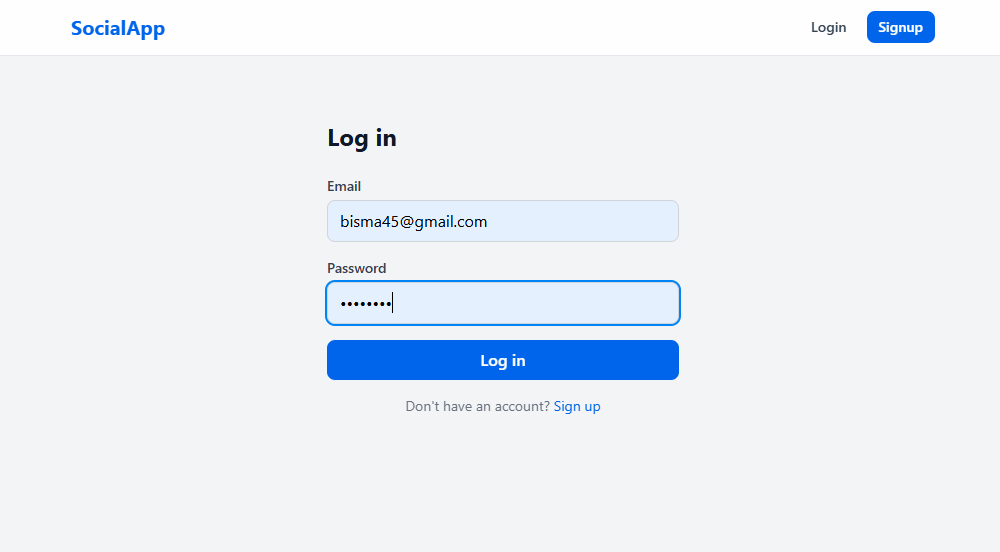
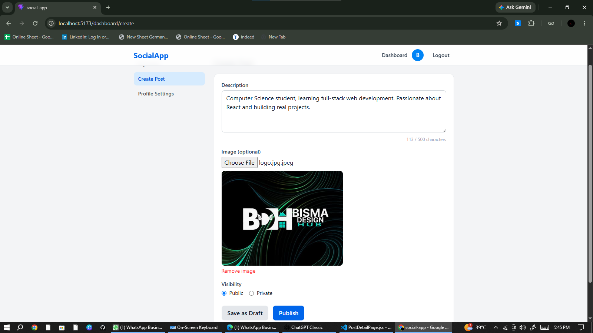
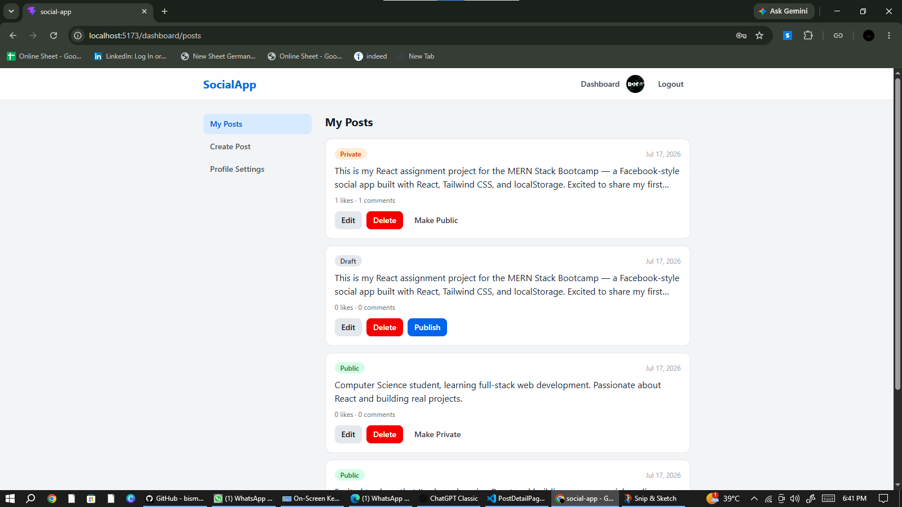
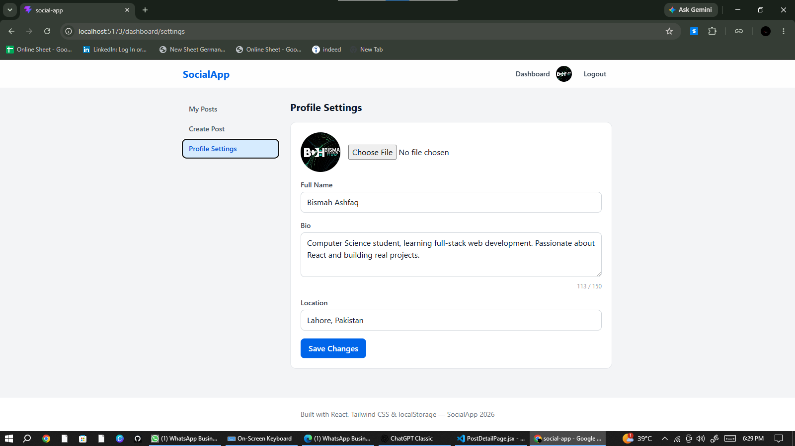
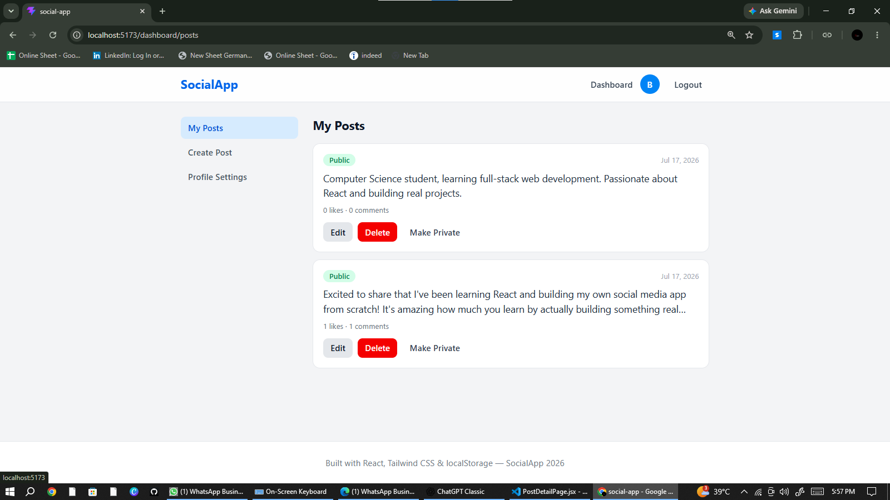

# SocialApp — Facebook-Inspired Social Media Platform

A frontend-only social media web application built with React, Tailwind CSS, and localStorage — inspired by Facebook. Users can sign up, create posts, like, comment, and manage their profile, all without a backend.

## Live Demo

🔗 [social-app-bisma.vercel.app](https://social-app-bisma.vercel.app)

## Screenshots

### Login Page





### Dashboard





### Create Post





### Profile Page





### Testing





## Tech Stack
- React (Vite)
- React Router v6
- Tailwind CSS
- React Hook Form
- Context API
- localStorage
- clsx

## Features
- User signup and login with form validation
- Session persists after page refresh
- Public feed showing all published posts
- Guests are redirected to login when trying to like/comment
- Create, edit, and delete posts with image upload
- Save posts as draft or publish them
- Toggle posts between public and private
- Like and unlike posts
- Add and delete comments on posts
- User profile pages with avatar, bio, location, and public posts
- Profile settings page to update name, bio, location, and avatar
- Protected dashboard routes (redirects to login if not authenticated)
- Fully responsive design with Tailwind CSS
- Code-split pages using React.lazy and Suspense for faster load times

## How to Run Locally
```bash
git clone https://github.com/bisma-dev46/Social-app-Bisma.git
cd social-app-your-name
npm install
npm run dev
The app will open at http://localhost:5173
Folder Structure
src/
├── components/
│   ├── layout/       Navbar, Footer
│   ├── post/         PostCard, PostForm, PostActions, CommentSection
│   ├── profile/      ProfileHeader
│   ├── ui/           Button, Input, Avatar, Modal, Badge
│   └── RequireAuth.jsx
├── context/
│   └── AuthContext.jsx
├── hooks/
│   ├── useAuth.js
│   ├── useLocalStorage.js
│   └── usePosts.js
├── pages/
│   ├── FeedPage.jsx
│   ├── LoginPage.jsx
│   ├── SignupPage.jsx
│   ├── PostDetailPage.jsx
│   ├── ProfilePage.jsx
│   ├── NotFoundPage.jsx
│   └── dashboard/
│       ├── DashboardLayout.jsx
│       ├── PostsDashboard.jsx
│       ├── CreatePost.jsx
│       ├── EditPost.jsx
│       └── ProfileSettings.jsx
├── utils/
│   ├── storage.js
│   └── helpers.js
├── App.jsx
└── main.jsx
localStorage Data Structure

users
{ id, name, email, password, bio, location, avatar, coverImage, joinedAt }

comments
{ id, postId, authorId, text, createdAt }

posts
{ id, authorId, description, image, isPublic, isDraft, createdAt, updatedAt }

likes
{ id, postId, userId, createdAt }

## What I Learned
Building this project taught me how to manage authentication state across an entire app using React Context, without relying on a real backend. I learned how to structure a React project with reusable components like buttons, inputs, and cards, instead of repeating the same code everywhere. Working with React Router's protected routes helped me understand how real apps control access to certain pages. I also got hands-on practice with React Hook Form for validation, and learned how to persist data using localStorage in a clean, organized way through a single storage utility file. Debugging import errors and case-sensitive file names also taught me to be much more careful and precise when naming files and components.

## Known Limitations
Since there is no real backend, all data is stored only in the browser's localStorage and is not shared between devices or browsers
Uploaded images are stored as base64 text, so very large images can fill up localStorage quickly
Passwords are stored in plain text since there is no real backend to hash them — this is only for learning purposes and would need proper security in a production app.
